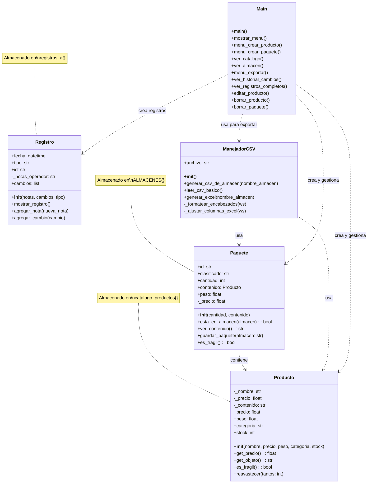

# Nuka-Store Manager 2077
"Con nuka-inventory ni una tuerca se pierde"

Nuka-Store Manager 2077 es una herramienta moderna y gratuita para gestionar inventario y productos en almacenes de cualquier tamaño
¡organiza tu mundo como si fuera el fin del mundo!"

Incluye pero no se limita a:
- Control de inventario en tiempo real
- Búsqueda rápida de productos
- Generación de reportes/registros en pkl y CSV

"Tecnología del mañana, ¡hoy mismo en su almacén! Con Nuka-Store Manager 2077, el futuro de la logística... está asegurado."

## Equipo Nuka-POOla
Nuestro grupo eligio la alternativa 1.

En esta se plantea un sistema de gestion de inventario para una bodega, nuestro grupo la tomo y espera centrarla en un sistema que pueda funcionar como sistema de envios, algo similar a los sistemas de los cuales disponen empresas tales como amazon, temu, entre otros.

Este sistema se plantea con diversas funciones y metodos mediante los cuales esperamos hacerlo trabajar. El funcionamiento esperado seria: 

Recibir la entrada de un objeto o paquete nuevo: El programa anotará la hora de entrada; asignará un numero de registro (con el cual se rastrearía el paquete); asignará un "espacio", en el cual dicho paquete se almacenaría hasta el momento de salida para que, cuando vaya a salir el paquete, sea llamado y  enviado fuera de la bodega; y, por último, se anotará su horario de salida. Se espera que con el numero de registro se pueda clasificar los paquetes en diferentes modulos mediante los cuales sea mas sencillo gestionarlos. Por ejemplo, se separarían de tal forma como: frágiles, pesados, vivos, urgencia, etc. Esto permite una gestion correcta y eficiente, ya que el usuario puede determinar cuales son los que llevan prioridad, dónde deben estar organizados, y si requieren algun trato especial, para posteriormente ser enviado a donde se haya encargado.  

Algunas de las ventajes del numero de registro son las siguientes:
1. clasificar los paquetes en diferentes modulos mediante los cuales sea mas sencillo gestionarlos. 
2. Asignarle caracteristicas especificas a los paquetes, por ejemplo: fragiles, pesados, vivos, , etc.
3. Permitir que el usuario determine la prioridad de cada paquete, ya sea: urgente, normal, baja prioridad.
4. generar una base de datos organizada con base en el numerode registro asociado al paquete, facilitando asi la busqueda de informacion y datos tales como: fecha de entrada, fecha de salida, caracteristicas del paquete, si esta el paquete en la bodega etc. (esto se piensa como tipo tabla de datos en exel que se pueda descargar)

